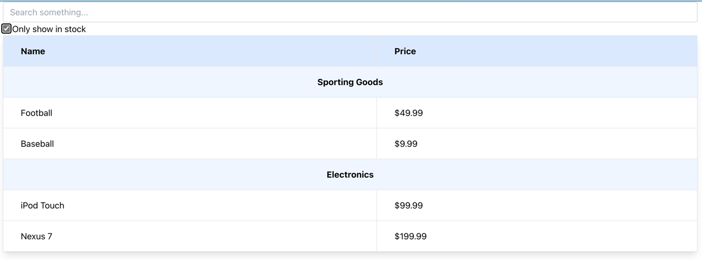

# React example

This is an application done for listing and filtering a static collection of products.

A simple _React_ application developed with Vite, using TypeScript and Tailwind.

## Images

### All products

### Only products in stock

### Filtered results

### No results

